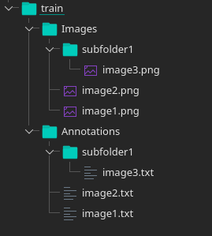

# YOLOv4-PyTorch

> **Minimal PyTorch implementation of YOLOv4**

### 1. Setting Up Environment

To train the model you would need a python environemnt with all the dependencies mentioned in requirements.txt installed. 
To install the dependencies run :

```
$ pip install -r requirements.txt
```

### 2. Preparing Data

**Folder structure**
To prepare your dataset for training using our implementation you will have to prepare two folders one for image and one for labels. For any image path in image folder a corresponding label file (same name but .txt extension) is searched in the labels folder. If the label file is found the image and labels will be used in the training process. 

Here is an example of the directory structure for the train folder. 




### 3. Training

One you have prepared your data and set the train path and validation path in the in the `cfg.py` file you can use `train.py` to begin training your model.

```
$ python train.py -g [GPU_ID]
```

Additional arguments could be provided to change some of the config parameters. 

The config parameters and their default values are mentioned below.

Argument|Default|Description
---|---|---
`-l` or `--load`|None|Path of the pretrained weight file (.pth) to load before training.
`--classes`|80|Number of dataset classes
`-r` or `--learning-rate`|0.001|Value of learning rate to use during training
`-g` or `--gpu`| -1 | Parameter for CUDA_VISIBLE_DEVICES (default value -1 will use CPU for training)
`--optimizer`| `adam` | Choose one optimizer from `adam` or `sgd`
